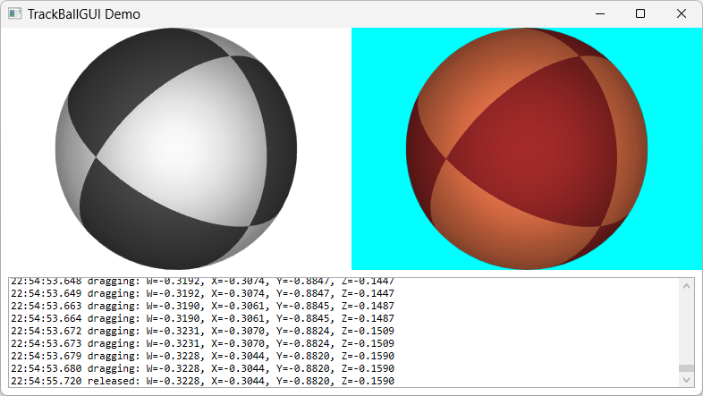

# TrackBallWPF
 TrackBall of WPF UserControl 

## Requirement
.NET 10.0 - windows  
WPF  

## Install
[Download DLL](https://github.com/tk-yoshimura/TrackBallWPF/releases)  
[Download Nuget](https://www.nuget.org/packages/tyoshimura.TrackBallWPF/)  

## Demo


## Usage

[Sample](TrackBallGUITest)

```xml
xmlns:trackball="clr-namespace:TrackBallGUI;assembly=TrackBallGUI"
```

```xml
<trackball:TrackBall
    x:Name="TrackBallControl"
    Rotation="{Binding Rotation}" />
```

```csharp
private void TrackBallControl_RotationChanged(object? sender, RotationChangedEventArgs e) {
    AppendLog($"dragging: {FormatQuaternion(e.Quaternion)}");
}
```

```csharp
// Note: NOT USE `System.Numerics.Quaternion`
private Quaternion selected_rotation = Quaternion.Identity;
public Quaternion Rotation {
    get => selected_rotation;
    set {
        selected_rotation = value;

        OnPropertyChanged(nameof(Rotation));
    }
}
```

## Licence
[MIT](LICENSE)

## Author

[T.Yoshimura](https://github.com/tk-yoshimura)
